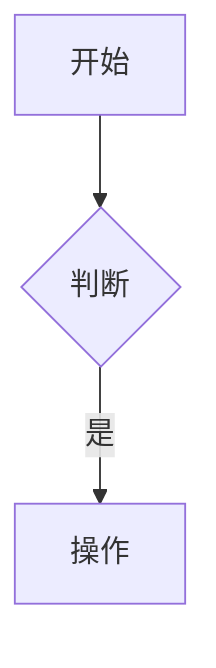
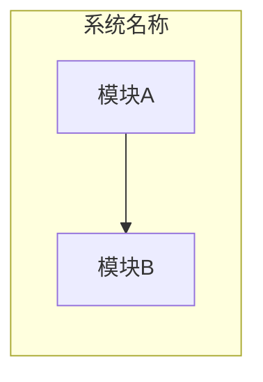

# 课程升级标准文档

> **版本**: v1.0  
> **制定日期**: 2026-05-06  
> **适用范围**: 第0-11课全部课程内容

---

## 📋 升级目标

本次升级旨在全面提升课程质量，确保内容的准确性、一致性和时效性。

### 核心目标
1. **内容质量提升** - 增强技术深度，补充最新动态，改进案例
2. **格式统一** - 统一所有课程的结构和风格
3. **技术栈更新** - 更新版本信息，补充新工具
4. **全面审查** - 检查准确性，修复错误，确保一致性

---

## 📐 格式统一标准

### 基础格式规范

参考：[课程格式规范.md](../课程格式规范.md)

**必备元素**：
1. 课程标题 + 元信息（时长、难度、风格）
2. 📋 本课概览（ASCII框图）
3. 🎬 Opening Hook（10分钟）
4. Section 1-N（标注时长）
5. 🎯 Closing（20分钟）
6. 📚 下节课预告
7. 📋 知识点速查表
8. 🎯 行动建议

### 标题层级统一

```markdown
# 课程主标题

## 🎬 Opening Hook（10分钟）

## Section 1：主题名称（时长）

### 1.1 子主题

#### 1.1.1 细节点

## 🎯 Closing（20分钟）
```

### Mermaid 图表标准

**流程图**：


**架构图**：


### 代码示例标准

```tsx
// ✅ 推荐的做法
const Component = () => {
  // 中文注释说明逻辑
  return <div>内容</div>;
};

// ❌ 不推荐的做法
const Component = () => {
  return <div>内容</div>;
};
```

---

## 🔄 技术栈更新清单

### 2026年5月技术状态

基于当前知识（截至2026年1月）和课程内容分析：

#### 1. Tailwind CSS v4
- **当前状态**: v4.x 系列
- **关键特性**: CSS-first配置、Oxide引擎、新颜色系统
- **更新建议**: 
  - 确认最新版本号
  - 补充v4.2+的新特性
  - 更新迁移指南

#### 2. shadcn/ui
- **当前状态**: 持续更新中
- **生态工具**: TweakCN、magic-ui、aceternity-ui
- **更新建议**:
  - 检查新增组件
  - 更新CLI命令
  - 补充最新的Registry特性

#### 3. Radix UI
- **当前状态**: 稳定版本
- **关键特性**: Composition模式、可访问性原语
- **更新建议**:
  - 确认最新原语列表
  - 更新API文档链接

#### 4. AI 编程工具
- **Cursor**: 持续更新，Composer功能增强
- **Windsurf**: Flow模式
- **Claude Code**: 终端集成
- **更新建议**:
  - 补充最新功能特性
  - 更新使用技巧
  - 补充Memory管理最佳实践

#### 5. Vercel AI SDK
- **当前状态**: v6.x
- **关键特性**: 统一接口、流式响应、RSC集成
- **更新建议**:
  - 确认最新API
  - 更新代码示例

#### 6. MCP 工具
- **Playwright MCP**: AI驱动的浏览器自动化
- **其他MCP**: Puppeteer、Browserbase、Stagehand
- **更新建议**:
  - 补充新的MCP服务器
  - 更新配置示例

#### 7. Design to Code
- **Figma AI**: AI Agents、Make Designs、Dev Mode
- **Pencil.dev**: IDE内设计、双向同步
- **v0.dev**: React + Tailwind + shadcn/ui生成
- **更新建议**:
  - 补充最新功能
  - 更新工作流示例

#### 8. 前端全栈化
- **Next.js 15**: Server Actions、Server Components
- **Supabase**: BaaS、Vector、MCP Server
- **Prisma**: ORM、类型安全
- **更新建议**:
  - 确认Next.js 15特性
  - 更新全栈技术栈对比

---

## 🔗 链接检查策略

### 优先级分类

**P0 - 必须修复**（核心资源）：
- 官方文档链接（Tailwind、shadcn/ui、Radix UI等）
- 关键工具链接（Cursor、v0.dev、Figma等）
- 课程设计文档中的参考资料

**P1 - 建议修复**（重要资源）：
- 技术博客文章
- 教程和指南
- 社区资源

**P2 - 可选修复**（补充资源）：
- 示例网站
- 演示链接
- 社区讨论

### 检查方法

1. **批量提取**: 从所有课程文件中提取链接
2. **分类整理**: 按优先级和类型分类
3. **重点验证**: 优先检查P0和P1链接
4. **更新记录**: 记录失效链接和替代方案

---

## 📊 内容质量标准

### 技术深度要求

1. **概念解释**
   - 清晰的定义
   - 为什么重要
   - 与AI友好性的关系

2. **技术细节**
   - 工作原理
   - 核心API/配置
   - 最佳实践

3. **实战案例**
   - 真实场景
   - 完整代码
   - 效果对比

### 横向对比标准

每个主题必须包含：
- 深讲1个主流方案
- 对比3-5个同类工具
- 对比表格（特性、优劣、适用场景）

### 案例质量标准

1. **真实性**: 基于实际项目场景
2. **完整性**: 包含完整的代码和说明
3. **可复现**: 学员可以跟着操作
4. **对比性**: 展示AI-Native vs 传统方式

---

## ✅ 质量检查清单

### 格式检查
- [ ] 标题层级正确（#/##/###/####）
- [ ] 时长标注完整（Opening、Section、Closing）
- [ ] 必备元素齐全（概览、速查表、行动建议）
- [ ] Mermaid图表格式统一
- [ ] 代码示例有语言标识和中文注释
- [ ] 使用✅/❌标注正确/错误做法

### 内容检查
- [ ] 技术版本号准确
- [ ] API和配置示例正确
- [ ] 外部链接有效
- [ ] 案例代码完整可运行
- [ ] 横向对比表格完整

### 一致性检查
- [ ] 术语使用统一
- [ ] 技术栈描述一致
- [ ] 课程间引用正确
- [ ] 与课程设计文档一致

### AI友好性检查
- [ ] 强调AI友好性特征
- [ ] 包含AI工具使用示例
- [ ] 对比传统vs AI-Native方式
- [ ] 提供Memory管理建议

---

## 🎯 升级执行策略

### 分组策略

**组A - 基础层**（第0-3课）：
- 第0课：认知重构
- 第1课：Tailwind CSS v4
- 第2课：shadcn/ui
- 第3课：Radix UI

**组B - 工具层**（第4-7课）：
- 第4课：Design to Code（上）
- 第5课：Design to Code（下）
- 第6课：Monorepo
- 第7课：MCP Tools

**组C - 集成层**（第8-11课）：
- 第8课：AI编程工具
- 第9课：Vercel AI SDK
- 第10课：工程化与全栈化
- 第11课：全链路整合

### 升级顺序

1. **组内串行**: 每组内的课程按顺序升级
2. **组间并行**: 三组可以并行处理
3. **依赖优先**: 被引用的课程优先升级

---

## 📝 升级记录模板

每节课升级后需要记录：

```markdown
### 第X课升级记录

**升级日期**: 2026-05-XX
**升级人员**: Claude Opus 4.7

**主要变更**:
1. 格式统一
   - [ ] 标题层级调整
   - [ ] 时长标注补充
   - [ ] 必备元素补全

2. 内容更新
   - [ ] 技术版本更新
   - [ ] 新特性补充
   - [ ] 案例改进

3. 质量提升
   - [ ] 链接修复
   - [ ] 错误修正
   - [ ] 一致性调整

**具体变更清单**:
- 变更1: 描述
- 变更2: 描述
- ...

**审查状态**: ⬜ 待审查 / ✅ 已审查
```

---

## 🚀 下一步行动

1. ✅ 制定升级标准（本文档）
2. ⬜ 执行分组升级（阶段2）
3. ⬜ 质量保证与优化（阶段3）
4. ⬜ 生成升级报告

---

**文档维护**: 本标准文档将在升级过程中持续更新和完善。
